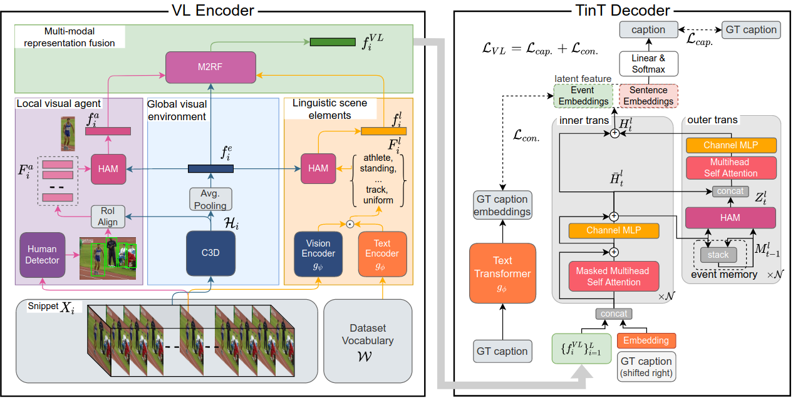

VLTinT: Visual-Linguistic Transformer-in-Transformer for Coherent Video Paragraph Captioning
=====
[](https://paperswithcode.com/sota/video-captioning-on-activitynet-captions?p=vltint-visual-linguistic-transformer-in)

[[`Project Page`](https://uark-aicv.github.io/VLTinT/)] [[`arXiv`](https://arxiv.org/abs/2211.15103)] [[`pdf`](https://arxiv.org/pdf/2211.15103.pdf)]

Video paragraph captioning aims to generate a multi-sentence description of an untrimmed video with several temporal event locations in coherent storytelling. 
Following the human perception process, where the scene is effectively understood by decomposing it into visual (e.g. human, animal) and non-visual components (e.g. action, relations) under the mutual influence of vision and language, we first propose a visual-linguistic (VL) feature. In the proposed VL feature, the scene is modeled by three modalities including (i) a global visual environment; (ii) local visual main agents; (iii) linguistic scene elements. We then introduce an autoregressive **Transformer-in-Transformer (TinT)** to simultaneously capture the semantic coherence of intra- and inter-event contents within a video. Finally, we present a new **VL contrastive loss function** to guarantee learnt embedding features are matched with the captions semantics. Comprehensive experiments and extensive ablation studies on ActivityNet Captions and YouCookII datasets show that the proposed Visual-Linguistic Transformer-in-Transform (VLTinT) outperforms prior state-of-the-art methods on accuracy and diversity. 



## Environment Setup
1. Clone this repository
```bash 
git clone https://github.com/UARK-AICV/VLTinT.git
cd VLTinT
```


2. Prepare Conda environment 

```bash
conda env create -f environment.yml
conda activate pytorch
```


3. Add project root to `PYTHONPATH`
> Note that you need to do this each time you start a new session.

```bash
source setup.sh
```

## Data preparation

We assume to have following file structure after this preparation.
>If you want to change the file structure, please modify the `data_path` in `src/rtransformer/recursive_caption_dataset.py`
```
cache
  |- anet_vocab_clip.pt
  |- anet_word2idx.json
  |- yc2_vocab_clip.pt
  |_ yc2_word2idx.json
data
  |- anet
  |   |- c3d_env
  |   |- c3d_agent
  |   |_ clip_b16
  |       |- lang_feature
  |       |_ sent_feature
densevid_eval
preprocess
scripts
src
video_feature
  |- anet_duration_frame.csv
  |_ yc2_duration_frame.csv
```

### 
Our features extracted from rescaled videos of ActivityNet-1.3 can be downloaded below:
* Env features are [here](https://uark.box.com/s/01twnsrjxbf7d48wki5s5v43ri5p66vl).
* Agent features are [here](https://drive.google.com/file/d/1lOQG1FgDseRKDs3RNgpKd000OOZiag1s/view?usp=sharing).
* Lang features are [here](https://uark.box.com/s/un9t7vv2l61u1541krqfxqro1t9hfkm4).

You can use our preprocessed features above or process by yourself as follows:

<details>
<summary><b>1. Download data</b></summary>
<br>

1. Download raw videos of [ActivityNet](https://cs.stanford.edu/people/ranjaykrishna/densevid/) and [YouCook2](http://youcook2.eecs.umich.edu/download) and convert all the videos into `mp4` for the later process (you need `ffmpeg` for the script below).

    ```bash
    python preprocess/convert_to_mp4.py --video-root path/to/video/dir --output-root path/to/dir/*.mp4
    ```

1. Rescale each video into 1600 frames and extract the middle frame of every 16 frames (100 middle frames will be extracted). 

    ```
    python preprocess/rescale_video.py --video-root path/to/dir/*.mp4 --output-root path/to/dir/rescaled --frame-dir path/to/dir/middle_frames
    ```
</details>

<details>
<summary><b>2. Env feature extraction</b></summary>
<br>

1. To extract the visual features from the rescaled videos, we will use [this](https://github.com/vhvkhoa/SlowFast) repo.
    ```
    git clone https://github.com/vhvkhoa/SlowFast
    cd SlowFast
    python setup.py build develop
    ```
    Then, run the following command to extract the env features.
    ```
    python tools/run_net.py --cfg configs/Kinetics/SLOWONLY_8x8_R50.yaml --feature_extraction --num_features 100 --video_dir path/to/dir/rescaled --feat_dir path/to/data/[anet/yc2]/c3d_env TEST.CHECKPOINT_FILE_PATH models/SLOWONLY_8x8_R50.pkl NUM_GPUS 1 TEST.CHECKPOINT_TYPE caffe2 TEST.BATCH_SIZE 1 DATA.SAMPLING_RATE 1 DATA.NUM_FRAMES 16 DATA_LOADER.NUM_WORKERS 0
    ```
    
</details>

<details>
<summary><b>3. Agent feature extraction</b></summary>
<br>

### 
1. To extract the agent features, we will use [detectron](https://github.com/facebookresearch/detectron2) for bbox detection. 
    ```
    git clone https://github.com/vhvkhoa/detectron2
    python -m pip install -e detectron2
    wget https://dl.fbaipublicfiles.com/detectron2/COCO-Detection/faster_rcnn_R_101_FPN_3x/137851257/model_final_f6e8b1.pkl
    python tools/bbox_extract.py path/to/dir/rescaled path/to/dir/bbox --config-file configs/COCO-Detection/faster_rcnn_R_101_FPN_3x.yaml --sampling-rate 16 --target-frames 100 --opts MODEL.WEIGHTS model_final_f6e8b1.pkl
    ```
    Then follow the command below to extract the agent features.
    ```
    cd SlowFast
    python tools/run_net.py --cfg configs/Kinetics/SLOWONLY_8x8_R50.yaml --feature_extraction --num_features 100 --video_dir path/to/dir/rescaled --feat_dir path/to/data/[anet/yc2]/c3d_agent MODEL.NUM_CLASSES 200 TEST.CHECKPOINT_TYPE caffe2 TEST.CHECKPOINT_FILE_PATH models/SLOWONLY_8x8_R50.pkl NUM_GPUS 1 TEST.BATCH_SIZE 1 DATA.PATH_TO_BBOX_DIR path/to/dir/bbox DETECTION.ENABLE True DETECTION.SPATIAL_SCALE_FACTOR 32 DATA.SAMPLING_RATE 1 DATA.NUM_FRAMES 16 RESNET.SPATIAL_STRIDES [[1],[2],[2],[1]] RESNET.SPATIAL_DILATIONS [[1],[1],[1],[2]] DATA.PATH_TO_TMP_DIR /tmp/agent_0/
    ```
    
</details>

<details>
<summary><b>4. Lang feature extraction</b></summary>
<br>


1. To extract the linguistic features from those videos, run the following commands. Change `--dset_name` to `anet` or `yc2` to specify the dataset.

    ```
    python preprocess/build_lang_feat_vocab.py --dset_name [anet/yc2]
    python preprocess/extract_lang_feat.py --frame-root path/to/dir/middle_frames --output-root path/to/data/[anet/yc2]/clip_b16/lang_feature --dset_name [anet/yc2]
    python preprocess/extract_sent_feat.py --caption_root ./densevid_eval/[anet/yc2]_data/train.json --output_root path/to/data/[anet/yc2]/clip_b16/sent_features
   ```
   
</details>

### Build Vocabularies
Execute following command to create a vocablary for the model. Change `--dset_name` to `anet` or `yc2` to specify the dataset.
```
python preprocess/build_vocab.py --dset_name [anet/yc2] --min_word_count 1
python preprocess/extract_vocab_emb.py --dset_name [anet/yc2]
```


## Training
To train our TinT model on ActivityNet Captions:
```
bash scripts/train.sh [anet/yc2] --use_env --use_agent --use_lang --use_tint
```
Here you can specify the dataset (ActivityNet:`anet` or YouCook2:`yc2`), whether to use each features (e.g., env, agent, and language), and whether to use the proposed TinT decoder (if turned off, run with MART decoder). 

Training log and model will be saved at `results/anet_re_*`.  
Once you have a trained model, you can follow the instructions below to generate captions. 

## Evaluation
1. Generate captions 
```
bash scripts/translate_greedy.sh anet_re_* [val/test]
```
Replace `anet_re_*` with your own model directory name. 
The generated captions are saved at `results/anet_re_*/greedy_pred_[val/test].json`


2. Evaluate generated captions
```
bash scripts/eval.sh anet [val/test] results/anet_re_*/greedy_pred_[val/test].json
```
The results should be comparable with the results of the paper. 

## Visualization
To visualize the result with the video (mp4):
```
python visualization/demo.py --input_mp4_folder /path/to/folder/contains/mp4 --output_mp4_folder /path/to/output/ --caption_file results/anet_re_*/greedy_pred_val.json --video_id v_5qsXmDi8d74
```

### Demo
<center>

</center>

## Citation
If you find this code useful for your research, please cite our papers:

```bibtex
@article{kashu_vltint,
　　title={VLTinT: Visual-Linguistic Transformer-in-Transformer for Coherent Video Paragraph Captioning},
　　volume={37},
　　url={https://ojs.aaai.org/index.php/AAAI/article/view/25412},
　　DOI={10.1609/aaai.v37i3.25412},
　　number={3},
　　journal={Proceedings of the AAAI Conference on Artificial Intelligence},
　　author={Yamazaki, Kashu and Vo, Khoa and Truong, Quang Sang and Raj, Bhiksha and Le, Ngan},
　　year={2023},
　　month={Jun.},
　　pages={3081-3090}
}
```

```bibtex
@INPROCEEDINGS{kashu_vlcap,
  author={Yamazaki, Kashu and Truong, Sang and Vo, Khoa and Kidd, Michael and Rainwater, Chase and Luu, Khoa and Le, Ngan},
  booktitle={2022 IEEE International Conference on Image Processing (ICIP)}, 
  title={VLCAP: Vision-Language with Contrastive Learning for Coherent Video Paragraph Captioning}, 
  year={2022},
  volume={},
  number={},
  pages={3656-3661},
  doi={10.1109/ICIP46576.2022.9897766}}
```

## Acknowledgement
We acknowledge the following open-source projects that we based on our work:

1. [MART](https://github.com/jayleicn/recurrent-transformer)

## Contact
Please feel free to create an issue on this repository for any questions, comments and reporting bugs. 
Send an email to [Kashu Yamazaki](https://kashu7100.github.io/) for other inquiries.
